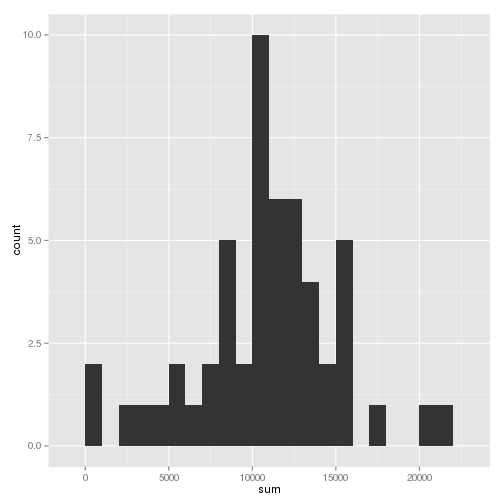
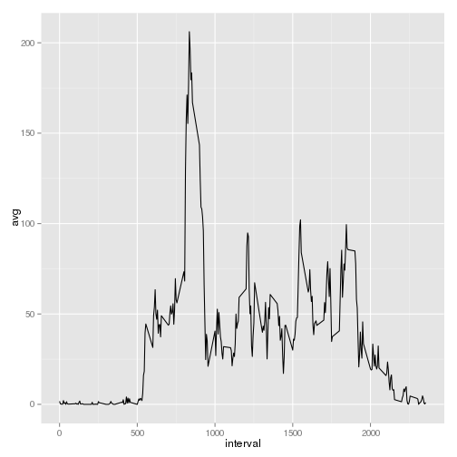
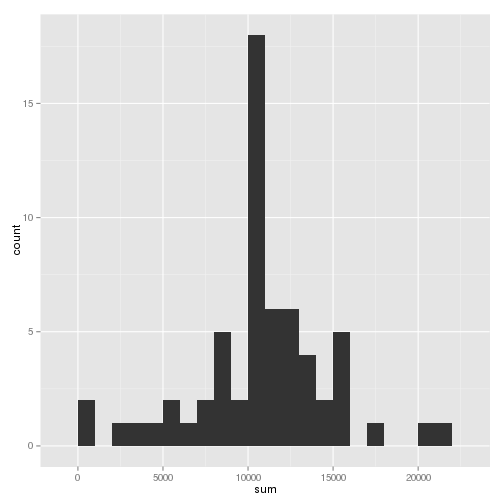
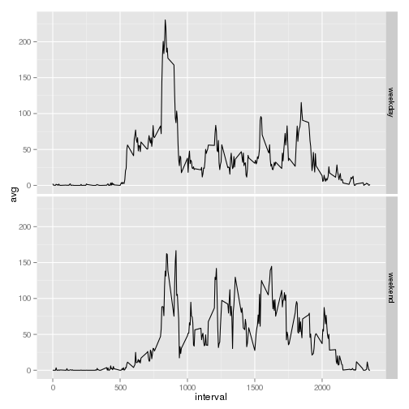

In our analysis we will use ggplot2 for plotting and dplyr for data manipulation.

```r
require(ggplot2)
require(dplyr)
```

## Loading and preprocessing the data
1. We load the data using read.csv()

```r
setwd("~/git/RepData_PeerAssessment1")
unzip('activity.zip')
data <- read.csv('activity.csv', na.string='NA', 
                colClasses = c('integer', 'character', 'integer'))
```

2. We convert the date column (it should be POSIXct as dplyr doesn't accept POSIXlt, POSIXt)

```r
data$date <- as.POSIXct(data$date)
```


## What is mean total number of steps taken per day?
0. Ignore NAs

```r
complete <- data[complete.cases(data),]
```

1. We summarise the data using `dplyr` in order to 
calculate the total number of steps taken per day.

```r
summarized <- group_by(complete, date) %>% summarise(sum = sum(steps, na.rm=T))
```

2. Using our summarized data frame, we can plot 
the histogram of the total number of steps taken each day

```r
qplot(sum, data=summarized, binwidth=1000)
```

 

3. We calculate the mean and median of the total number of steps taken per day

```r
mean(summarized$sum, na.rm=T)
```

```
## [1] 10766.19
```

```r
median(summarized$sum, na.rm=T)
```

```
## [1] 10765
```


## What is the average daily activity pattern?
1. We make a time series plot of the 5-minute interval (x-axis) 
and the average number of steps taken, averaged across all days (y-axis)

```r
averaged <- group_by(data, interval) %>% summarise(avg = mean(steps, na.rm=T))
qplot(interval, avg, data=averaged, geom='line')
```

 

2. Which 5-minute interval, on average across all the days in the dataset, 
contains the maximum number of steps?

```r
averaged$interval[which.max(averaged$avg)]
```

```
## [1] 835
```


## Imputing missing values
1. Calculate and report the total number of missing values 
in the dataset (i.e. the total number of rows with NAs)

```r
sum(1-complete.cases(data))
```

```
## [1] 2304
```

2. and 3. We fill NAs by filling average value for that 5min interval

```r
nas <- is.na(data$steps)
filled <- data
filled$steps[nas] <- averaged$avg[match(data$interval[nas], averaged$interval)]
```

4.

```r
summarized2 <- group_by(filled, date) %>% summarise(sum = sum(steps, na.rm=T))
qplot(sum, data=summarized2, binwidth=1000)
```

 

```r
mean(summarized2$sum, na.rm=T)
```

```
## [1] 10766.19
```

```r
median(summarized2$sum, na.rm=T)
```

```
## [1] 10766.19
```
In our first dataset (data) there were 8 days full of NAs, those were replaced with mean day
in our second dataset. As a result we can see increase in 10k-11k category (corresponding to mean).
Mean wasn't changed, while median changed to mean and variance was decreased.


## Are there differences in activity patterns between weekdays and weekends?
1. We create factor variable with 2 levels weekday/weekend.

```r
filled$weekend <- 
    factor(weekdays(filled$date) %in% c("Sunday","Saturday"), labels=c('weekday','weekend'))
```

2. We make a panel plot containing a time series plot (i.e. type = "l") 
of the 5-minute interval (x-axis) and the average number of steps taken, 
averaged across all weekday days or weekend days (y-axis).

```r
averaged2 <- group_by(filled, interval, weekend) %>% summarise(avg = mean(steps, na.rm=T))
qplot(interval, avg, data=averaged2, facets=weekend~., geom='line')
```

 


